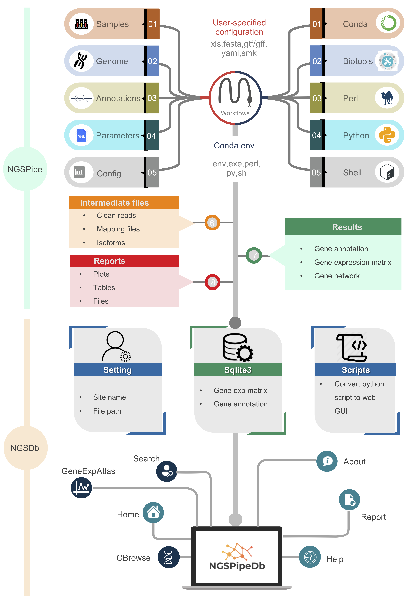

# NGSPipeDb - NGS pipeline and database

__Author:__ Dr. Xuan Zhang*    
__Last update:__ 2021-01-20*  
__Citation:__ NGSPipeDb: An automated pipeline for parallel processing of huge NGS data and database generation.

## What can NGSPipeDb do 

__NGSPipeDb__ is an automated pipeline for parallel processing of huge next generation sequencing (NGS) data and database generation using [snakemake workflow](https://snakemake.readthedocs.io/en/stable/index.html) which allows for ease of use, optimal speed, and a highly modular code that can be further added onto and customized by experienced users. It can be further divided into `NGSPipe` and `NGSDb` for individual usage. 

__NGSPipe__ consists of a [Snakefile](https://snakemake.readthedocs.io/en/stable/snakefiles/rules.html) (`ngspipe/rnaseq.snakefile.py`, it includes some basic rules `ngspipe/rule/*.snakefile.py`), [conda](https://conda.io/docs/) environment files (`ngspipe/envs/*.yaml`), a configuration file (`ngspipe/config/rnaseq.config.yaml`), a set of [python](#), [R](#), [Shell](#) and [Perl](#) scripts (`ngspipe/scripts/*.py`), and a set of [reStructuretext](#) reports (`reports/*.rst`). It combines the use of several dozen omic-seq tools, suites, and packages to create a complete pipeline that takes [RNA-seq analysis](), [resequcing analysis]() etc. from raw sequencing data all the way through alignment, quality control, unsupervised analyses, differential expression, and downstream pathway analysis. It is implemented such that alternative or similar analysis can be added or removed. The results are compiled in a simple and highly visual [report](ngspipe/metadata/report.html) containing the key figures to explain the analysis, and then compiles all of the relevant files, tables, and pictures into an easy to navigate folder. Table file such as csv, tsv, xlsx etc. 

It is based on snakemake and includes the following tools:
* shovill (based on Spades)
* QUAST v.5 (including BUSCO)
* mash
* fastp

It will read untrimmed raw data from your illumina sequencing experiments as paired .fastq.gz-files. These are then trimmed, assembled and polished. Besides generating ready-for-use contigs, AQUAMIS will select the closest reference genome from NCBI RefSeq and produce an intuitive, detailed report on your data and assemblies to evaluate its reliability for further analyses. It relies on reference-based and reference-free measures such as coverage depth, gene content, genome completeness and contamination, assembly length and many more. Based on the experience from thousands of sequencing experiments, threshold sets for different species have been defined to detect potentially poor results.

In addition, __NGSDb__ has been outfitted with several recently published tools that allow for visualize and data share.can be convert to [Sqlite3](#) format. The [Django](#) project and apps can be orgined by user defined. It is easy to share your data with a web inteface. a set of `apps` (such as `home`, `igv`, `geneExpAtlas`, `efp brwose`).

By default, the __NGSPipeDb__ performs all the steps shown in the [diagram](img/report_2019_03_14_salmonAlignment_visualization.png) below. However, advanced user, you can easily modify the `Snakefile` and the `config.yaml` and/or add "custom rules" to enable additional functions.

Currently, transcript quantification with `Salmon` at the read-level or gene quantification by [`featureCounts`](http://subread.sourceforge.net) can be activated.
The first version handles [RNA-Seq](#) workflow.

Workflows available:
- RNA-seq
- ChIP-seq
- Resequencing

__TODO__:

- NGSPipe
    1. miRNA
    2. scRNA-seq
    3. ATAC-seq
- NGSdb
    1. efp browser

## Contributing

Please [submit an issue](https://github.com/xuanblo/NGSPipeDb/issues) to report bugs or ask questions.

Please contribute bug fixes or new features with a [pull request](https://github.com/xuanblo/NGSPipeDb/pulls) to this
repository.

If this does not help, please feel free to consult:
* Xuan Zhang ([zhangxuan@xtbg.ac.cn](mailto:zhangxuan@xtbg.ac.cn)) or
* Changning Liu ([liuchangning@xtbg.ac.cn](mailto:liuchangning@xtbg.ac.cn))

## Resources